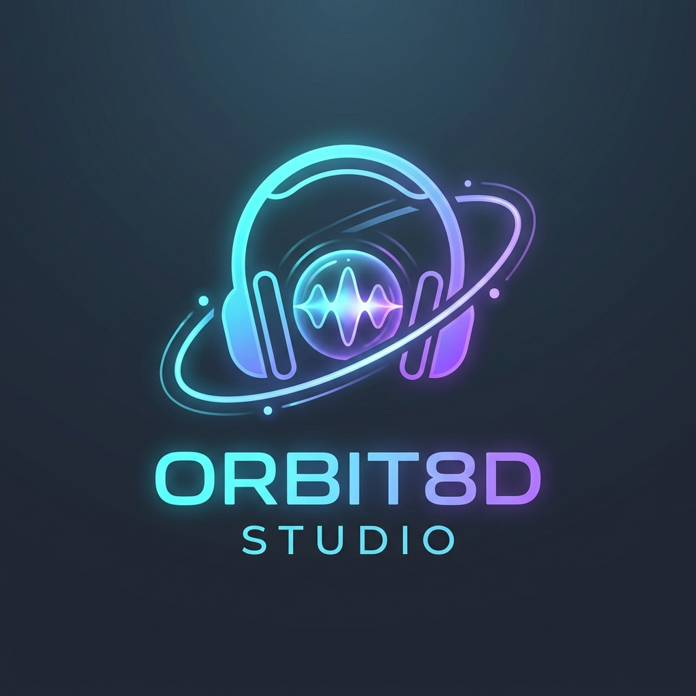

<p align="center">
  
</p>

<h1 align="center">🎧 ORBIT8D STUDIO</h1>

<p align="center">
  <strong>Next-Gen 8D Spatial Audio Maker & High-Speed Batch Converter</strong><br>
  <em>Ubah audio biasa menjadi pengalaman suara 3D Spasial 360° yang mengitari kepala pendengar dengan teknologi Web Audio API (HRTF Binaural Panning) & Batch OfflineAudioContext.</em>
</p>

<p align="center">
  
  
  
  
  
</p>

---

## 📑 Daftar Isi
* [Tentang Audio 8D & Cara Kerjanya](#-tentang-audio-8d--cara-kerjanya)
* [Fitur Utama](#-fitur-utama)
* [Cara Menjalankan Aplikasi Web](#-cara-menjalankan-aplikasi-web)
* [Panduan Penggunaan Fitur & Menu](#-panduan-penggunaan-fitur--menu)
  * [1. Studio Live Editor](#1-studio-live-editor)
  * [2. 3D Spatial Radar Visualizer (Interaktif)](#2-3d-spatial-radar-visualizer-interaktif)
  * [3. Menu Kontrol DSP (Sound Engine)](#3-menu-kontrol-dsp-sound-engine)
  * [4. Preset Siap Pakai](#4-preset-siap-pakai)
  * [5. Batch Converter (Konversi Massal ke ZIP)](#5-batch-converter-konversi-massal-ke-zip)
  * [6. Tombol Panduan Interaktif](#6-tombol-panduan-interaktif)
* [Panduan Script Python CLI](#-panduan-script-python-cli)
* [Struktur Direktori](#-struktur-direktori)
* [Lisensi](#-lisensi)

---

## 🧠 Tentang Audio 8D & Cara Kerjanya

**Audio 8D** adalah ilusi psikoakustik yang membuat pendengar merasakan suara bergerak memutar mengelilingi kepalanya dalam ruang 3 dimensi. 

> [!IMPORTANT]
> **Wajib Menggunakan Headphone / Earphone**: Efek audio 8D bekerja dengan memanfaatkan *Interaural Time Difference (ITD)* dan *Interaural Level Difference (ILD)* secara independen antara telinga kiri dan telinga kanan. Jika diputar melalui speaker laptop atau speaker bluetooth eksternal biasa, suara kedua kanal akan bercampur di udara sebelum masuk ke telinga sehingga efek spasial 3D tidak akan terasa.

Prinsip DSP di **Orbit8D Studio**:
1. **HRTF (*Head-Related Transfer Function*) 3D Panner**: Memetakan posisi koordinat audio secara dinamis pada sumbu $(X, Y, Z)$ mengitari kepala pendengar $(0, 0, 0)$.
2. **Dynamic Head-Shadowing**: Filter akustik frekuensi tinggi (*low-pass*) otomatis saat posisi suara berada di belakang kepala pendengar, meniru karakteristik fisik penyerapan daun telinga (*pinna occlusion*).
3. **Algorithmic Room Reverb**: Simulasi pantulan gema ruangan nyata (*Concert Hall, Studio, Cathedral, Cosmic Void*) agar audio tidak terasa kering.
4. **Bass Preserver**: Menjaga dentuman frekuensi rendah (*sub-bass & kick drum*) tetap bulat dan bertenaga saat audio bergerak melintasi kanal stereo.

---

## 🚀 Fitur Utama

- 🎧 **Studio Live Editor**: Dengarkan audio 8D secara *real-time* saat lagu sedang diputar dengan latensi sangat rendah.
- 🌐 **3D Spatial Radar Canvas**: Radar visual interaktif yang menampilkan posisi suara, ekor partikel komet (*trail*), gelombang pulsa, dan spektrum audio melingkar 360°.
- 🖱️ **Interactive Drag & Drop Sound Source**: Klik dan geser titik suara langsung di atas canvas radar untuk menempatkan audio di posisi mana pun dalam ruang 3D.
- ⚡ **High-Speed Batch Converter**: Drag & drop puluhan lagu sekaligus (MP3, WAV, FLAC, M4A, OGG). Diproses menggunakan `OfflineAudioContext` (lagu berdurasi 3–4 menit selesai dalam **3–5 detik**).
- 📦 **1-Click ZIP Download**: Kemas seluruh hasil konversi batch menjadi 1 file `.zip` siap pakai menggunakan JSZip.
- ✨ **Procedural Synthwave Demo Track**: Hasilkan musik *chillwave* secara sintetis langsung di browser tanpa perlu upload file untuk langsung menguji efek 8D.
- 📖 **In-App Interactive Guide**: Tombol panduan lengkap di sudut kanan atas yang menjelaskan seluruh menu dan cara penggunaan.
- 🔒 **100% Client-Side & Private**: File audio Anda **tidak pernah diunggah ke server mana pun**; semua proses pemrosesan terjadi secara lokal di browser Anda.

---

## 💻 Cara Menjalankan Aplikasi Web

Aplikasi ini tidak membutuhkan instalasi database atau backend rumit. Cukup jalankan server lokal:

### Opsi A: Menggunakan Python (Praktis)
```bash
python -m http.server 8088
```
Lalu buka browser Anda di: **[http://localhost:8088](http://localhost:8088)**

### Opsi B: Menggunakan Node.js / npx serve
```bash
npx -y serve .
```

---

## 📖 Panduan Penggunaan Fitur & Menu

### 1. Studio Live Editor
Panel utama untuk menguji, mendengarkan secara *live*, dan menyesuaikan parameter audio 8D:
* **Pilih Audio**: Klik tombol `📁 Pilih Audio` untuk mengunggah lagu favorit Anda (mendukung MP3, WAV, FLAC, M4A, OGG).
* **Coba Demo Musik**: Jika Anda belum memiliki file audio di komputer, klik `✨ Coba Demo Musik` untuk mendengarkan lagu sintetis *chillwave/synthwave* yang otomatis di-generate oleh Web Audio API.
* **Master Audio Deck**:
  * Tombol **Play / Pause** di bagian bawah.
  * Seekbar linier untuk melompat ke detik mana pun dari lagu.
  * Slider volume master.
  * Tombol **`⬇️ Export 8D Audio (WAV)`**: Merender audio dengan pengaturan efek aktif ke file WAV berkualitas studio 16-bit PCM.

---

### 2. 3D Spatial Radar Visualizer (Interaktif)
Tampilan canvas radar di panel kiri memvisualisasikan kepala pendengar dan posisi audio dari sudut pandang atas (*top-down*):
* **Avatar di Tengah (YOU)**: Kepala pendengar dengan headphone bercahaya yang menghadap ke depan (**FRONT**).
* **Orb Bercahaya (8D)**: Titik sumber suara yang berputar.
* **Fitur Drag & Drop**:
  * Klik dan tahan titik orb suara dengan kursor mouse atau layar sentuh.
  * Geser ke arah mana pun (kiri, kanan, belakang, atau sangat dekat dengan kepala) untuk mendengar efek spasialnya secara instan.
* **Kembali ke Rotasi Otomatis**:
  * Klik dua kali (*double-click*) di mana saja pada canvas radar untuk melanjutkan putaran orbit otomatis.

---

### 3. Menu Kontrol DSP (Sound Engine)
Panel di sisi kanan menyediakan kontrol mendalam terhadap karakteristik audio 8D:

| Pengaturan | Fungsi | Rentang Nilai |
| :--- | :--- | :--- |
| **Kecepatan Putaran (Speed)** | Mengatur berapa detik waktu yang dibutuhkan untuk 1 siklus putaran 360° penuh. | 3 detik (sangat cepat) s/d 30 detik (sangat lambat) |
| **Pola Lintasan (Pattern)** | **Circle 360°**: Putaran melingkar seimbang.<br>**Figure-8**: Pola angka 8 melintasi depan dan belakang kepala.<br>**Pendulum**: Suara mengayun bolak-balik antara telinga kiri dan kanan. | Circle / Figure-8 / Pendulum |
| **Arah Rotasi (Direction)** | Memilih arah putaran: Searah jarum jam (*Clockwise*) atau Berlawanan (*Counter-Clockwise*). | Clockwise / Counter |
| **Radius Jarak (Distance)** | Mengatur seberapa jauh suara terdengar dari telinga. Nilai kecil terasa intim, nilai besar terasa megah di kejauhan. | 0.8 meter s/d 4.0 meter |
| **Elevasi Vertikal (3D Height)** | Memberi kedalaman tinggi pada sumbu vertikal ($Y$). Suara terasa melayang di atas kepala (+Y) atau di bawah dagu (-Y). | -0.8 meter s/d +1.5 meter |
| **Tipe Ruangan (Acoustic Space)** | Pilihan karakter ruangan virtual: *Concert Hall* (megah), *Studio Room* (hangat), *Cathedral* (gema tinggi), dan *Cosmic Void* (ruang hampa luas). | Hall / Room / Cathedral / Space |
| **Intensitas Reverb (Wet Mix)** | Mengatur persentase campuran sinyal gema ruangan terhadap sinyal asli. | 0% (kering) s/d 75% (sangat basah) |
| **Head-Shadowing** | Sakelar filter otomatis yang meredam frekuensi tinggi ketika audio berada di belakang kepala pendengar ($Z < 0$). | Aktif / Non-aktif |
| **Bass Preserver (Low-End Boost)** | Penguat frekuensi rendah (*low-shelf filter* pada 120Hz) agar dentuman kick drum dan bass 808 tidak tipis saat panning ekstrem. | 0.0dB s/d +8.0dB |

---

### 4. Preset Siap Pakai
Di atas radar visualizer tersedia tombol *chip* preset cepat:
* 🌟 **Classic 8D**: Putaran 12 detik, reverb hall sedang. Karakter seimbang dan paling populer di YouTube/TikTok.
* 🏎️ **Fast Dynamic**: Putaran cepat 6 detik, bass boost +4dB. Sangat cocok untuk EDM, Trap, dan DnB.
* 🌌 **Cinematic 8D**: Pola angka 8 (Figure-8) dengan reverb katedral yang megah. Cocok untuk orkestra, akustik, dan film score.
* ↔️ **Pendulum**: Ayunan lembut kiri-kanan. Sangat pas untuk vokal, podcast, dan spoken word.
* 🧘 **ASMR & Chill**: Radius dekat (1.2m) dengan gema lembut untuk suasana rileks dan intim.

---

### 5. Batch Converter (Konversi Massal ke ZIP)
Ingin mengubah puluhan lagu sekaligus?
1. Klik tab **`⚡ Batch Converter`** di bagian atas aplikasi.
2. Tarik dan lepaskan (*drag & drop*) banyak file audio sekaligus ke area dropzone (atau klik tombol untuk memilih dari penjelajah berkas).
3. Tabel antrean akan menampilkan nama file, ukuran, durasi, dan status.
4. Klik tombol **`⚡ Mulai Konversi Semua`**:
   - Pemrosesan berjalan secara paralel/sekuensial menggunakan `OfflineAudioContext`.
   - Progress bar tiap lagu akan berjalan dari 0% hingga 100%.
5. Setelah selesai:
   - Anda bisa mengunduh file satu per satu dengan tombol `⬇️ Unduh`.
   - Atau klik tombol **`📦 Download Semua (ZIP)`** untuk mengunduh seluruh file 8D yang telah dikemas rapi dalam satu file ZIP (`Orbit8D_Batch_Converted.zip`).

---

### 6. Tombol Panduan Interaktif
* Di sudut kanan atas terdapat tombol **`📖 Panduan`**.
* Klik tombol tersebut kapan saja untuk membuka jendela dokumentasi interaktif yang merangkum seluruh instruksi di atas tanpa harus meninggalkan aplikasi.
* Tekan tombol `Esc` atau klik tombol `✕` untuk menutupnya.

---

## 🐍 Panduan Script Python CLI

Selain aplikasi web, proyek ini menyertakan script Python pendamping `batch_converter.py` bagi Anda yang ingin memproses folder audio lewat terminal:

```bash
python batch_converter.py --input ./folder_lagu --output ./hasil_8d --speed 12.0 --reverb 0.30
```

### Parameter:
* `--input`, `-i`: Folder yang berisi file audio `.wav`.
* `--output`, `-o`: Folder tujuan penyimpanan audio 8D hasil konversi.
* `--speed`, `-s`: Kecepatan satu siklus rotasi 360° dalam detik (default: `12.0`).
* `--reverb`, `-r`: Rasio kadar reverb gema ruangan dari `0.0` sampai `0.6` (default: `0.30`).

---

## 📁 Struktur Direktori

```
Orbit8D-Studio/
├── assets/
│   └── logo.jpg                # Logo resmi Orbit8D Studio
├── css/
│   └── style.css               # Desain Cyberpunk Dark Studio, glassmorphism & responsive
├── js/
│   ├── audio-engine.js         # Core DSP: PannerNode HRTF, Head-shadowing, Reverb, WAV exporter
│   ├── visualizer.js           # Canvas 3D Spatial Radar, Orbit Trail & Circular Spectrum
│   ├── batch-processor.js      # Queue Manager, OfflineAudioContext batch render, JSZip packager
│   └── app.js                  # Main controller, presets, audio player, UI bindings
├── .gitignore                  # Git ignore untuk file OS, cache, dan temporary audio
├── batch_converter.py          # Script Python CLI batch converter
├── index.html                  # Antarmuka studio & batch converter tab
└── README.md                   # Dokumentasi lengkap
```

---

## 📄 Lisensi

Proyek ini dirilis di bawah lisensi [MIT License](LICENSE). Bebas digunakan, dimodifikasi, dan didistribusikan untuk kebutuhan pribadi maupun komersial.


